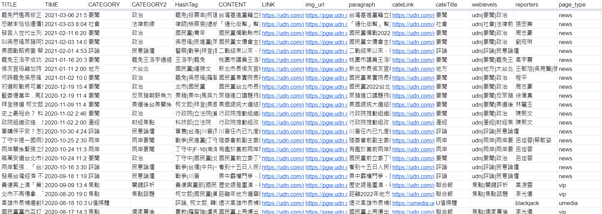

# udn-crawler-2021 
爬取聯合報網站的範例程式碼，只使用 request。

## Pipeline
1. 使用 `keyword` 搜尋 udn 網站
2. 獲取搜尋結果網址列表
3. 進入網址
4. 判斷該網址導向的頁面類型
5. 獲取 content 內容

## 目前只針對 udn 以下網域做對應爬取:
- https://udn.com/news
- https://vip.udn.com (部分內容)
- https://house.udn.com
- https://style.udn.com
- https://stars.udn.com
- https://health.udn.com
- https://theme.udn.com
- https://opinion.udn.com
- https://udn.com/umedia
- https://game.udn.com
